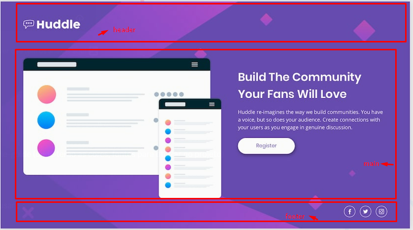

# Front-end Style Guide

# NÃO É NECESSÁRIO O USO DO GRID NESTE PROJETO, FACILITE

# Como eu organizo o projeto?

## Cores para serem usadas no projeto 

- Violet: hsl(257, 40%, 49%);
- Soft Magenta: hsl(300, 69%, 71%);

## Icones
- [Icones do FontAwesome](https://fontawesome.com/v5/search)
- [Font Awesome](https://fontawesome.com/)

# Guia de Estilo Front-end - Retirado do Frontend Mentor

## Layout

Os designs foram criados para as seguintes larguras:

- Mobile: 375px
- Desktop: 1440px

> 💡 Esses são apenas os tamanhos de design. Certifique-se de que o conteúdo seja responsivo e atenda aos requisitos do WCAG testando em toda a faixa de tamanhos de tela, desde 320px até telas maiores.

## Cores

### Primárias

- Violeta: hsl(257, 40%, 49%)
- Magenta Suave: hsl(300, 69%, 71%)

## Tipografia

### Títulos

- Família: [Poppins](https://fonts.google.com/specimen/Poppins)
- Pesos: 400, 600

### Corpo do Texto

- Família: [Open Sans](https://fonts.google.com/specimen/Open+Sans)
- Pesos: 400

## Ícones

Para os ícones sociais, você pode usar uma biblioteca de fontes de ícones. Algumas sugestões estão abaixo:

- [Font Awesome](https://fontawesome.com/)
- [IcoMoon](https://icomoon.io/)
- [Ionicons](https://ionicons.com/)

> 💎 [Atualize para Pro](https://www.frontendmentor.io/pro?ref=style-guide) para acessar os arquivos de design, ver todos os detalhes do design e obter experiência prática usando um fluxo de trabalho profissional com ferramentas como o Figma.